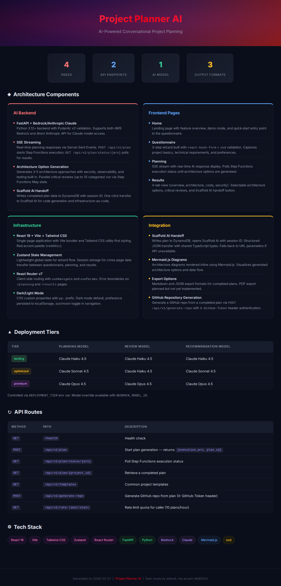
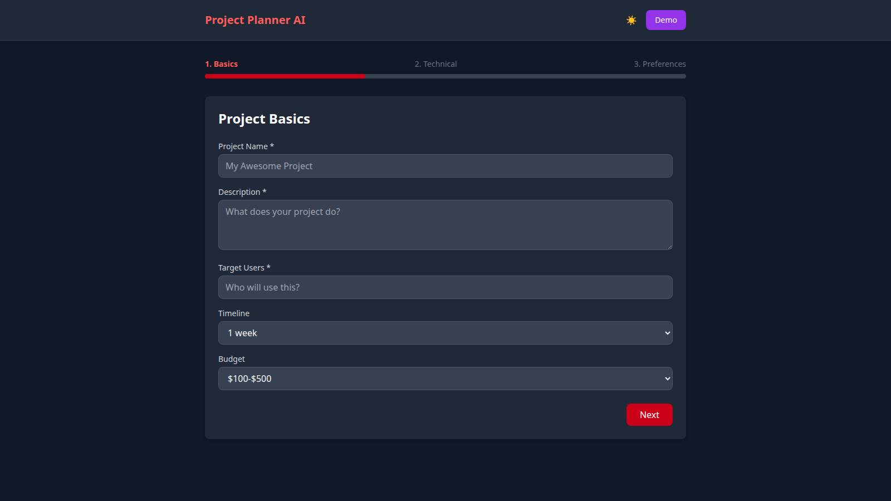
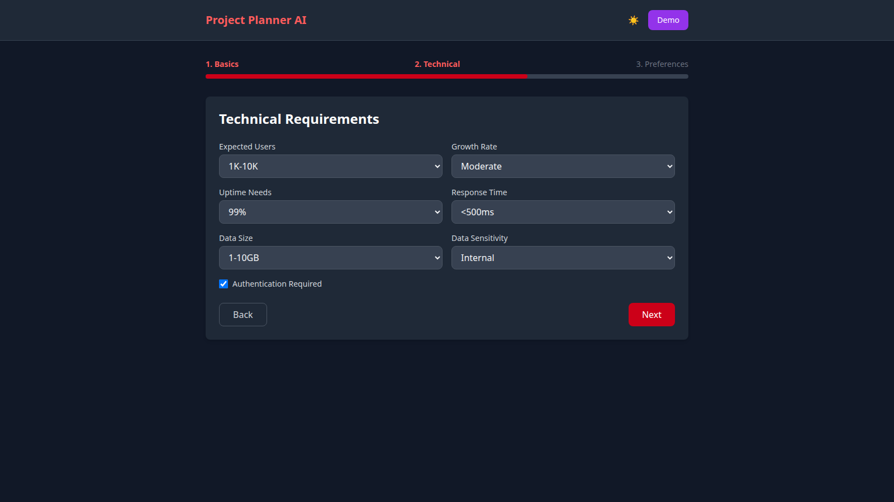
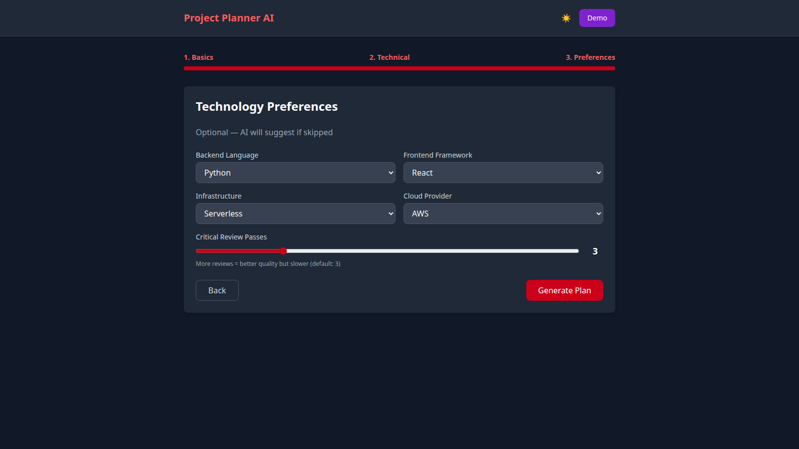
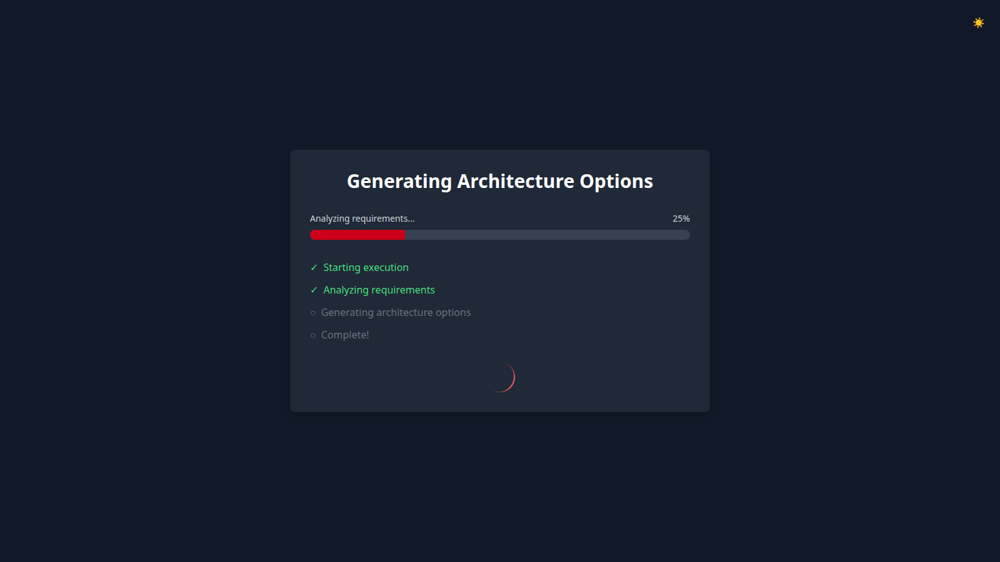
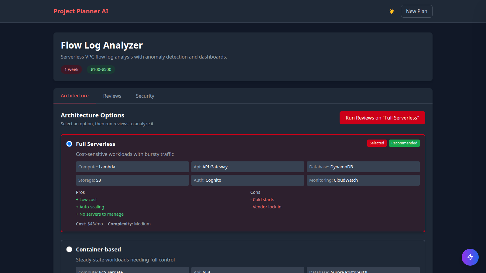

# Project Planner AI

> Turn ideas into production-ready, secure-by-default project plans through conversational AI refinement

[](https://opensource.org/licenses/MIT)
[](https://github.com/jfowler-cloud/project-planner-ai/actions)
[](https://www.python.org/downloads/)
[](https://www.typescriptlang.org/)


Describe your project in plain language — Project Planner AI refines your idea through an interactive chat, generates architecture options with security and operational best practices baked in, runs configurable critical reviews (security, cost, scalability), and produces a comprehensive plan. Hand it off to [Scaffold AI](https://github.com/jfowler-cloud/scaffold-ai) for code generation and AWS deployment.

## Architecture Overview

See the interactive [Architecture Overview](docs/architecture.html) for a visual summary of pages, API, AI integration, and data flow.



---

## Screenshots

| Landing Page | Questionnaire — Basics |
|:---:|:---:|
|  |  |

| Questionnaire — Technical | Questionnaire — Preferences |
|:---:|:---:|
|  |  |

| Planning in Progress | Results Overview |
|:---:|:---:|
|  |  |

---

## How It Works

```
Questionnaire → Step Functions → Parallel Reviews (x10) → Results → Scaffold AI
   (3 steps)    (Lambda + SFN)    (SFN Map state)         (4 tabs)   (one click)
```

1. **Answer simple questions** — project basics, technical requirements, preferences (no jargon required)
2. **AI generates architecture options** — 3-5 approaches with security, observability, and testing built in from the start
3. **Parallel critical review** — 10 review categories (security, cost optimization, scalability, reliability, performance, maintainability, developer experience, compliance, observability, disaster recovery) run concurrently via Step Functions Map state
4. **Review results** — 4-tab view: overview, architecture, reviews, security
5. **Hand off to Scaffold AI** — one-click transfer for code generation and infrastructure-as-code

The frontend invokes Lambda functions directly via Cognito identity pool credentials — no API Gateway.

---

## Secure-by-Default Output

Every architecture option generated by Project Planner AI includes production-grade security, observability, and operational best practices from the start — not as an afterthought.

### What's Included by Default

All generated plans follow the standards defined in [PROJECT_STANDARDS.md](https://github.com/jfowler-cloud/project-status-portal/blob/main/PROJECT_STANDARDS.md).

#### Security (Least Privilege from Day One)

| Practice | How It's Applied |
|----------|-----------------|
| **IAM least privilege** | Every Lambda, CodeBuild, and Step Functions role scoped to only the resources it needs. No `*` policies. |
| **Encryption at rest** | DynamoDB (AWS-managed KMS), S3 (AES-256 or KMS), Secrets Manager (auto-encrypted) |
| **Encryption in transit** | HTTPS enforced on all API endpoints, TLS for database connections |
| **Authentication** | Cognito user pool with MFA optional, identity pool for temporary credentials |
| **Authorization** | Group-based roles (admin/user) with scoped IAM policies per group |
| **Secret management** | All tokens/keys in Secrets Manager or SSM Parameter Store — never in code or env vars |
| **Dependency scanning** | Dependabot enabled, `npm audit` and `pip-audit` in CI |
| **Input validation** | Pydantic (backend) and Zod (frontend) on all external inputs |
| **CORS** | Explicit origin allowlist, no wildcards |

#### Observability

| Practice | How It's Applied |
|----------|-----------------|
| **Structured logging** | AWS Lambda Powertools Logger on every handler |
| **Distributed tracing** | X-Ray via Powertools Tracer |
| **Custom metrics** | Powertools Metrics for business events (invocations, errors, duration) |
| **CloudWatch alarms** | Lambda error rate, P99 duration, DynamoDB throttles, Step Functions failures |
| **Cost tagging** | All resources tagged with `Project`, `Environment`, `ManagedBy` |
| **Budget alerts** | AWS Budget alarm per project (default $25/month threshold) |

#### Testing & CI/CD

| Practice | How It's Applied |
|----------|-----------------|
| **Mono-repo structure** | `apps/web`, `apps/functions`, `apps/agents`, `apps/infra` |
| **Frontend tests** | Vitest + React Testing Library, 93% line coverage threshold |
| **Frontend E2E** | Playwright with axe-core accessibility checks |
| **Backend tests** | pytest + moto, 95% line coverage threshold |
| **CDK tests** | Snapshot tests + assertion tests for all stacks |
| **CI pipeline** | GitHub Actions: 5-job (frontend, functions, agents, infra, security) |
| **Branch protection** | CI must pass before merge to main |

#### UI & Theme

| Practice | How It's Applied |
|----------|-----------------|
| **Dark mode default** | Dark mode enabled by default, preference persisted to localStorage |
| **Red accent palette** | Consistent red accent (`#e8001c` primary) across all projects |
| **Tailwind projects** | Custom `accent` color scale in `tailwind.config.ts` |
| **Toggle button** | Sun/moon toggle in top navigation, same placement across all apps |

#### Operational Readiness

| Practice | How It's Applied |
|----------|-----------------|
| **DynamoDB PITR** | Point-in-time recovery enabled on all tables |
| **Removal policy** | `RETAIN` on stateful resources (tables, user pools), `DESTROY` on ephemeral |
| **CLAUDE.md** | AI assistant context for AI-assisted development |
| **PSP integration** | config.json compatible with [Project Status Portal](https://github.com/jfowler-cloud/project-status-portal) monitoring |

---

## Features

- Interactive 3-step questionnaire with demo mode
- **Secure-by-default output** — least privilege IAM, encryption, observability, testing baked into every plan
- Portfolio architecture standards enforced in AI prompts
- Real-time plan status polling via Step Functions execution ARN
- Configurable review passes (1-10 categories)
- Selectable architecture options during planning
- AWS Bedrock integration (Claude via Strands SDK)
- 3 deployment tiers (testing / optimized / premium)
- Results page with 4 tabs (overview, architecture, reviews, security)
- **Scaffold AI integration** — DynamoDB-based handoff with session IDs and graceful fallback
- **PSP integration** — Generated repos include config.json for Project Status Portal monitoring
- GitHub repository generation from completed plans

### Integration with Scaffold AI

Project Planner AI and [Scaffold AI](https://github.com/jfowler-cloud/scaffold-ai) work together for a complete plan-to-code workflow:

- **One-click handoff** — Purple sidebar button writes plan data to `project-planner-handoff` DynamoDB table, opens Scaffold AI with `?from=planner&session={id}`
- **DynamoDB-based transfer** — Cognito-authenticated writes from Planner, reads from Scaffold. 24h TTL auto-cleanup. No intermediate backend needed
- **Graceful fallback** — If DynamoDB is unavailable, Scaffold falls back to clipboard-based import via URL `prompt` parameter
- **Review findings included** — Full review findings array + markdown summary sent in handoff payload

See [INTEGRATION.md](INTEGRATION.md) for complete integration documentation.

### Not Yet Implemented
- Refinement chat UI (conversational refinement between questionnaire and planning)
- PDF/Markdown export
- Team collaboration

---

## Tech Stack

| Layer | Technology |
|-------|-----------|
| Frontend | React 19 + Vite SPA, Tailwind CSS, Zustand, React Hook Form + Zod, React Router v7 |
| Backend | AWS Lambda (Python 3.13+), Lambda Powertools, Strands SDK |
| Orchestration | AWS Step Functions (Map state for parallel reviews) |
| AI | Claude via Amazon Bedrock (Strands SDK) |
| Database | DynamoDB (on-demand, PITR) |
| Auth | Cognito User Pool + Identity Pool |
| Infra | CDK v2 TypeScript |
| Hosting | S3 + CloudFront |
| Package Mgmt | uv (backend), npm (frontend) |
| Testing | pytest + moto (backend), Vitest (frontend), Playwright (E2E), Jest (CDK) |
| CI/CD | GitHub Actions (5 jobs) |

### AI Models by Deployment Tier

| Tier | Planning | Review | Recommendation |
|------|----------|--------|----------------|
| Testing | Claude Haiku 4.5 | Claude Haiku 4.5 | Claude Haiku 4.5 |
| Optimized | Claude Sonnet 4.5 | Claude Haiku 4.5 | Claude Sonnet 4.5 |
| Premium | Claude Opus 4.5 | Claude Opus 4.5 | Claude Opus 4.5 |

---

## Quick Start

### Deploy Infrastructure

```bash
git clone https://github.com/jfowler-cloud/project-planner-ai
cd project-planner-ai
./setup.sh                        # Install all dependencies and run tests

cd apps/infra && npx cdk deploy --all   # Deploy Lambda, SFN, DynamoDB, Cognito, S3+CloudFront
./scripts/setup-env.sh            # Populate frontend VITE_* env vars from CDK outputs
./dev.sh                          # Start frontend dev server on port 3000
```

### Docker (Frontend only)

```bash
docker-compose up
```

---

## Environment Variables

```bash
# Deployment tier (testing/optimized/premium)
DEPLOYMENT_TIER=testing

# AWS
AWS_REGION=us-east-1

# Frontend (populated by scripts/setup-env.sh)
VITE_AWS_REGION=us-east-1
VITE_USER_POOL_ID=...
VITE_USER_POOL_CLIENT_ID=...
VITE_IDENTITY_POOL_ID=...
VITE_SCAFFOLD_URL=http://localhost:3001
```

---

## Project Structure

```
project-planner-ai/
├── apps/
│   ├── web/                    # React + Vite SPA
│   │   ├── src/
│   │   │   ├── pages/          # Home, Questionnaire, Planning, Results
│   │   │   ├── components/     # ScaffoldIntegration, MermaidDiagram, etc.
│   │   │   └── lib/            # store.ts (Zustand), config.ts, api.ts
│   │   └── __tests__/          # Vitest unit tests
│   ├── functions/              # Lambda handlers — one per Step Functions state
│   │   ├── generate_plan/      # Initial architecture plan via Strands
│   │   ├── review_step/        # Single review iteration (invoked via Map state)
│   │   ├── finalize_plan/      # Persist completed plan to DynamoDB
│   │   ├── get_execution/      # Poll SFN execution status
│   │   └── tests/              # pytest + moto
│   ├── agents/
│   │   └── shared/             # config.py, db.py — shared across functions
│   └── infra/                  # CDK v2 TypeScript
│       ├── lib/
│       │   ├── database-stack.ts   # Cognito, DynamoDB, S3+CloudFront, SNS, Budget
│       │   ├── functions-stack.ts  # Lambda functions + layers
│       │   └── workflow-stack.ts   # Step Functions state machine
│       └── test/               # Jest snapshot + assertion tests
├── .github/workflows/          # CI (5 jobs), deploy, security scan
├── dev.sh                      # Frontend dev server
├── deploy.sh                   # CDK deploy + frontend build
├── setup.sh                    # Initial setup
├── scripts/setup-env.sh        # Populate VITE_* from CDK outputs
└── docker-compose.yml          # Frontend-only Docker setup
```

---

## Integration with Scaffold AI

Project Planner AI and [Scaffold AI](https://github.com/jfowler-cloud/scaffold-ai) work together for a complete plan-to-code workflow:

1. Complete your project plan in Project Planner AI (questionnaire → planning → results)
2. Click the purple floating button (bottom-right corner) → "Open in Scaffold AI"
3. Your plan data — including security standards and architecture — auto-populates the Scaffold AI chat
4. Scaffold AI generates infrastructure-as-code, CI/CD pipelines, test scaffolds, and security configs
5. Generated repo includes: mono-repo structure, coverage thresholds, CloudWatch alarms, CLAUDE.md, PSP config

---

## Code Reviews (Mar 2026)

Two full code reviews completed — all critical/high findings resolved:

- Rewrote frontend API layer from REST to AWS SDK (SFN + Lambda via Cognito credentials)
- Extracted `PORTFOLIO_STANDARDS` to shared module (`apps/agents/shared/constants.py`)
- Fixed ScaffoldIntegration data shape mismatch and added proper TypeScript interfaces
- Added Cognito Authenticator, CDK snapshot stability (`stripAssetHashes()`), form validation fixes

### Known Issues

- **Zustand store unused** — `store.ts` is defined but pages use `useState` + `sessionStorage` instead
- **Session storage fragility** — refreshing loses plan state; DynamoDB persistence planned
- **Shared types not wired** — `packages/shared-types/` has full interfaces but frontend imports types locally

### Test Coverage

- Frontend: 164 tests across 10 test files, 99%+ lines (all thresholds met)
- Backend: 14 tests across 15 backend test files, 95% lines (all pass)
- CDK: 17 snapshot + assertion tests (all pass)

### Strengths

- **Clean mono-repo structure** with clear separation (functions, agents, infra, web)
- **Portfolio standards enforcement** baked directly into AI prompts — every generated plan will conform
- **Observability from day one** — Powertools Logger/Tracer/Metrics on every handler, CloudWatch alarms, X-Ray
- **Graceful degradation** — `generate_plan` returns a sensible fallback if Bedrock fails
- **Security posture** — Cognito, least-privilege IAM, encrypted DynamoDB, PITR, RETAIN policies
- **Scaffold AI integration** well-designed with API-first handoff + URL fallback
- **CDK test suite** covers all 3 stacks with 20 assertions + 3 snapshot tests
- **Full frontend-backend wiring** — SFN start + Lambda polling via Cognito identity pool credentials

---

## Known Limitations

### Session Storage
The frontend uses `sessionStorage` to pass data between pages. Refreshing loses state, and results aren't shareable via URL. Server-side plan persistence (DynamoDB) is planned.

### Planner → Scaffold Handoff
The primary integration path writes plan data to the `project-planner-handoff` DynamoDB table with session IDs. The fallback path copies to clipboard for manual paste.

---

## Scaffold AI Integration — Coupling Analysis

Project Planner AI (Part 1) generates architecture plans; [Scaffold AI](https://github.com/jfowler-cloud/scaffold-ai) (Part 2) turns those plans into infrastructure-as-code and deployable repos.

### Current State

| Aspect | Status | Notes |
|--------|--------|-------|
| `exportToScaffold()` API function | **DONE** | Writes to `project-planner-handoff` DynamoDB table via Cognito credentials |
| ScaffoldIntegration sidebar button | **DONE** | Opens Scaffold AI with `?from=planner&session={id}` on success, clipboard fallback on failure |
| Scaffold `usePlannerImport` hook | **DONE** | Reads from DynamoDB with graceful fallback to URL prompt parsing |
| `PlannerNotification` + auto-submit | **DONE** | Auto-populates chat on import |
| Review findings in handoff | **DONE** | Full `review_findings` array + `review_summary` markdown included |
| Authentication | **DONE** | Cognito identity pool credentials — both Planner (write) and Scaffold (read) use IAM-authenticated DynamoDB access |
| `PlannerRefineButton` (Scaffold → Planner) | Exists | Clipboard-based, no receive path in Planner |

### Remaining Recommendations

#### P1 — Important

1. **Wire up shared types package** (package exists, not yet imported)
   - `packages/shared-types/src/index.ts` has complete TypeScript interfaces (`ProjectBasics`, `TechnicalRequirements`, `ArchitectureOption`, `ReviewFinding`, `ScaffoldHandoffRequest`)
   - Frontend still defines types locally in `Results.tsx`, `ScaffoldIntegration.tsx`, `store.ts`
   - Wire up tsconfig path alias to import from `@project-planner/shared-types`
   - *Files:* `apps/web/tsconfig.json`, `apps/web/package.json`

2. **Align security scoring**
   - Planner uses risk levels: `low | medium | high | critical`
   - Scaffold uses numeric scores: `0-100` (security gate passes at ≥ 70)
   - Define a mapping: `critical=0-25, high=26-50, medium=51-75, low=76-100`
   - Include numeric score in handoff so Scaffold can skip redundant security review for pre-vetted plans
   - *Files:* `apps/agents/shared/constants.py` (add mapping), `ScaffoldIntegration.tsx` (compute score)

#### P2 — Nice to have (developer experience)

8. **Extract PORTFOLIO_STANDARDS to a shared package**
   - Both projects bake portfolio standards into AI prompts independently
   - If standards drift, Planner generates plans that Scaffold's security gate rejects
   - Create a shared Python package or a JSON file both projects import at build time
   - *Files:* `apps/agents/shared/constants.py`, Scaffold's equivalent

9. **Synchronize deployment tiers**
   - Both projects have `testing | optimized | premium` tiers with the same model map
   - If Planner runs on `premium` (Opus) and Scaffold on `testing` (Haiku), quality mismatches occur
   - Options: shared SSM parameter for tier, or include tier in handoff metadata so Scaffold matches
   - *Files:* `apps/agents/shared/config.py`, Scaffold's `config.py`

10. **Implement bidirectional refinement**
    - Scaffold has `PlannerRefineButton` that copies to clipboard and opens Planner
    - Planner has no receive path — add a `?from=scaffold&feedback=<encoded>` query param handler
    - Parse feedback and pre-populate a refinement prompt in Questionnaire or Results page
    - *Files:* `Results.tsx` or new `Refinement.tsx` page, `App.tsx` (add route)

11. **Connect markdown export to Scaffold import**
    - Results.tsx `buildSummaryMarkdown()` generates structured findings markdown
    - Include as `review_markdown` field in handoff — Scaffold can display in PlannerNotification
    - *Files:* `ScaffoldIntegration.tsx`, Scaffold's `usePlannerImport.ts`

12. **Update INTEGRATION.md**
    - References `NEXT_PUBLIC_*` env vars (leftover from Next.js) — should be `VITE_*`
    - Claims `Project Planner Backend: http://localhost:8000` — backend was removed in v2.1.0
    - Shared types package described but doesn't exist — update to reflect actual state
    - *Files:* `INTEGRATION.md`

13. **PSP config.json in handoff**
    - Plans generated by Planner should include a `config.json` template for PSP monitoring
    - Scaffold should include this in generated repos so new projects are automatically monitored
    - *Files:* `apps/functions/generate_plan/handler.py` (add to output), Scaffold's code generation

### Implementation Priority

```
Phase 1 (Enable handoff):     #1 Re-enable button, #2 Include findings, #3 Include markdown
Phase 2 (Production-ready):   #4 DynamoDB sessions, #5 Auth, #6 Shared types, #7 Score alignment
Phase 3 (Polish):             #8 Shared standards, #9 Tier sync, #10 Bidirectional, #11-13 DX
```

---

## Roadmap

### Phase 1: Scaffold Handoff + Persistence
- [x] ~~Re-enable Scaffold AI export button with review findings + markdown summary~~
- [x] ~~Replace in-memory sessions with DynamoDB (`project-planner-handoff` table, 24h TTL)~~
- [x] ~~Cognito-authenticated DynamoDB access (Planner writes, Scaffold reads)~~
- [ ] Migrate pages to use Zustand store instead of sessionStorage
- [ ] DynamoDB persistence for shareable plan URLs

### Phase 2: Shared Types + Polish
- [ ] Wire `packages/shared-types/` into frontend (package exists with full interfaces, not yet imported)
- [ ] Align security scoring (risk levels ↔ numeric 0-100)
- [ ] Refinement chat UI (conversational refinement between questionnaire and planning)

### Phase 3: Export & Polish
- [x] ~~Markdown export of review findings (copy + download)~~
- [ ] PDF export
- [ ] PSP config.json auto-generation in plan output and Scaffold handoff
- [x] ~~Extract duplicate `PORTFOLIO_STANDARDS` to shared module~~
- [x] ~~Frontend coverage thresholds met~~

### Phase 4: Advanced
- [ ] Bidirectional refinement (Scaffold → Planner feedback loop)
- [ ] Shared PORTFOLIO_STANDARDS package across all portfolio projects
- [ ] Synchronized deployment tiers via SSM parameter
- [ ] Team collaboration
- [ ] Multi-cloud support (Azure, GCP)
- [ ] Compliance templates (HIPAA, SOC2)

## UI Formatting Note

This project uses a questionnaire-driven wizard flow (not a chat interface) with Tailwind CSS and React Router. It uses `react-markdown` for rendering plan output but does not yet include `remark-gfm` for GFM tables. It does not have the full UI polish of [recon-ai](https://github.com/jfowler-cloud/recon-ai), which includes CSS custom properties (`:root` dark/light color palette), chat markdown with GFM and session persistence, empty state illustrations, responsive media queries, notification toasts, and keyboard shortcuts. The Tailwind-based styling provides a different design language than the Cloudscape-based projects.

---

## Portfolio Context

| | Resume Tailor AI | Project Planner AI | Scaffold AI |
|---|---|---|---|
| **Purpose** | Resume optimization | Project planning | AWS architecture design |
| **AI** | Claude via Bedrock | Claude via Bedrock | Claude via Bedrock |
| **Backend** | Lambda + SFN | Lambda + SFN | Lambda + SFN |

---

## Changelog

### v2.1.0 - Remove FastAPI, Lambda-only Backend (Mar 2026)

- Removed `apps/backend/` FastAPI application (was dev-only, never deployed)
- Production backend is Lambda + Step Functions exclusively
- Updated CI from 6 jobs to 5 (removed backend job)
- Updated dev.sh, setup.sh, docker-compose.yml
- Portfolio standards baked into all AI prompts

### v2.0.0 - Step Functions + Strands Refactor (Mar 2026)

> **Looking for the LangChain version?** The previous LangChain-based pipeline is preserved on the [`legacy/langchain`](https://github.com/jfowler-cloud/project-planner-ai/tree/legacy/langchain) branch.

- Replaced LangChain/in-process pipeline with AWS Step Functions + Strands agent core
- 10 review iterations now run as a Step Functions Map state (maxConcurrency=3)
- Added `apps/functions/` Lambda handlers: `generate_plan`, `review_step`, `finalize_plan`, `get_execution`
- Added `apps/agents/shared/` config + db helpers
- Added `apps/infra/` CDK stack with Step Functions state machine + DynamoDB PlansTable
- CloudWatch alarms (Lambda error rate, P99 duration, DynamoDB throttles, SFN execution failures)
- AWS Budget alarm ($25/mo, 80% threshold) with SNS topic
- CDK snapshot + assertion tests

### v1.3.0 - React + Vite SPA Migration (Mar 2026)
- Migrated frontend from Next.js 15 to React 19 + Vite SPA
- All pages ported to `src/pages/` with React Router v7
- Migrated all tests from Jest globals to Vitest `vi.*` API

---

## Contributing

Contributions welcome! See [CONTRIBUTING.md](CONTRIBUTING.md) for guidelines.

---

## License

MIT License — see [LICENSE](LICENSE) for details.

---

## Author

**James Fowler**
- GitHub: [@jfowler-cloud](https://github.com/jfowler-cloud)
- LinkedIn: [James Fowler](https://www.linkedin.com/in/james-fowler-aws-cloud-architect-dev-ops-professional/)

**Related Projects:**
- [Scaffold AI](https://github.com/jfowler-cloud/scaffold-ai) — AWS architecture designer and code generator
- [Resume Tailor AI](https://github.com/jfowler-cloud/resume-tailor-ai) — AI-powered resume optimization
